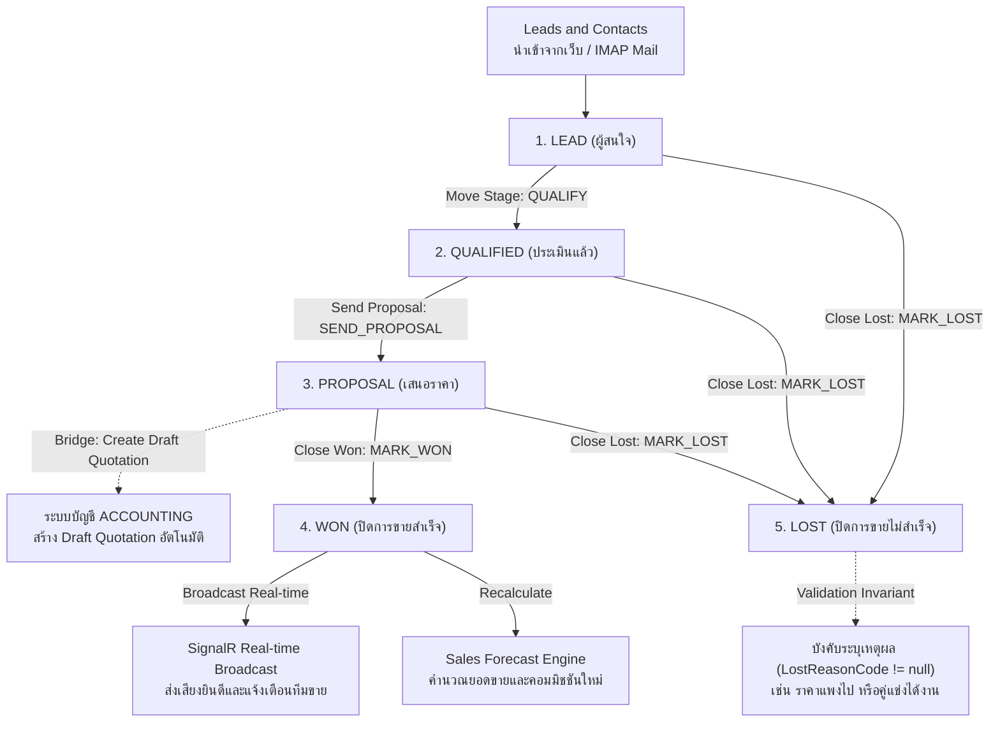

# 08_CRM_ENGINE: Enterprise Sales Pipeline & Deal Management

ระบบบริหารความสัมพันธ์ลูกค้าและกระบวนการขาย (Customer Relationship Management - CRM) พร้อมกระดาน Kanban Board แบบลากวาง (Drag & Drop), การเชื่อมต่ออีเมลสองทาง (IMAP/SMTP), การคำนวณคาดการณ์ยอดขาย (Sales Forecast) แบบ Real-time, และการเชื่อมต่อระบบบัญชีเพื่อออกใบเสนอราคาอัตโนมัติ

---

## 🔄 ภาพรวม Workflow การทำงาน (Business & Technical Workflow)

### รายละเอียดขั้นตอนการเปลี่ยนสถานะ (State Transitions):
1. **`LEAD ➔ QUALIFIED` (Trigger: `QUALIFY`)**: พนักงานขายโทรพูดคุยและประเมินงบประมาณ (Budget, Authority, Need, Timeline)
2. **`QUALIFIED ➔ PROPOSAL` (Trigger: `SEND_PROPOSAL`)**: ส่งใบเสนอราคาทางอีเมล พร้อมสั่งให้ระบบสร้าง Draft Quotation ในระบบบัญชี
3. **`PROPOSAL ➔ WON` (Trigger: `MARK_WON`)**: ลูกค้าเซ็นรับข้อเสนอ ปิดการขายสำเร็จ ส่งสัญญาณ Real-time ฉลองความสำเร็จทั้งออฟฟิศ
4. **`ANY ➔ LOST` (Trigger: `MARK_LOST`)**: กรณีลูกค้าปฏิเสธ ต้องระบุสาเหตุตาม **Invariant Rule** เพื่อนำข้อมูลไปวิเคราะห์ต่อ

---

## 🛡️ กฎเหล็กของระบบ (Domain Invariants)

1. **`StageTransitionsSequentialOrClosed` (การเปลี่ยน Stage ต้องเป็นไปตามลำดับขั้น หรือปิดดีล)**:
   - ป้องกันไม่ให้พนักงานขายข้ามขั้นตอนสำคัญ เช่น จาก Lead กระโดดไป Won ทันทีโดยไม่มีการส่ง Proposal ก่อน
2. **`LostRequiresReasonCode` (ต้องระบุเหตุผลเมื่อแพ้ดีล)**:
   - ห้ามมาร์กดีลเป็น `LOST` โดยไม่ระบุสาเหตุ เพื่อให้ผู้บริหารสามารถวิเคราะห์สาเหตุการแพ้ดีล (Loss Reason Analytics) และปรับปรุงกลยุทธ์ขององค์กรได้

---

## 💻 Tech Stack & เหตุผลในการเลือกใช้

| ส่วนประกอบ | เทคโนโลยีที่เลือก | เหตุผลที่เลือก | ข้อดีหลัก (Advantages) |
|---|---|---|---|
| **Frontend Kanban** | **Next.js 16 + @dnd-kit/core** | ไลบรารี Drag & Drop ประสิทธิภาพสูง รองรับ Touch Screen และ Keyboard Accessibility | ลากวางการ์ดดีลข้ามสเตจได้อย่างลื่นไหล 60 FPS ไม่หน่วง |
| **Real-time Pipeline** | **@microsoft/signalr** | การอัปเดตกระดานแบบ Multi-user Real-time Synchronization | เมื่อเพื่อนร่วมทีมขยับดีล หน้าจอของทุกคนในทีมจะอัปเดตทันทีแบบไม่มีข้อขัดแย้ง |
| **Backend API** | **.NET 10 (C#) + MediatR** | CQRS Architecture ที่แข็งแกร่ง | แยกขั้นตอนการประมวลผลดีลและการส่งอีเมลออกจากกันอย่างมีระเบียบ |
| **Email Protocol** | **MailKit / MimeKit** | ไลบรารีจัดการอีเมล IMAP/SMTP มาตรฐานสูงสุดใน .NET | อ่านอีเมลตอบกลับจากลูกค้าและแนบประวัติการสนทนาเข้ากับดีลได้แบบอัตโนมัติ |
| **Database & JSONB**| **PostgreSQL 18 (JSONB) + Redis** | เก็บ Custom Attributes ของแต่ละธุรกิจในรูป JSONB แบบมี Index | รองรับฟิลด์ข้อมูลที่ยืดหยุ่นของแต่ละประเภทลูกค้าโดยไม่ต้องเปลี่ยน Schema บ่อยๆ |

---

## 🚀 สรุปสถาปัตยกรรม (Architecture Highlights)

- **Event-Driven Sales Engine**: ทุกการปิดดีลสามารถ Trigger ไปยังระบบการเงินและระบบสต็อกสินค้าได้อย่างไร้รอยต่อ
