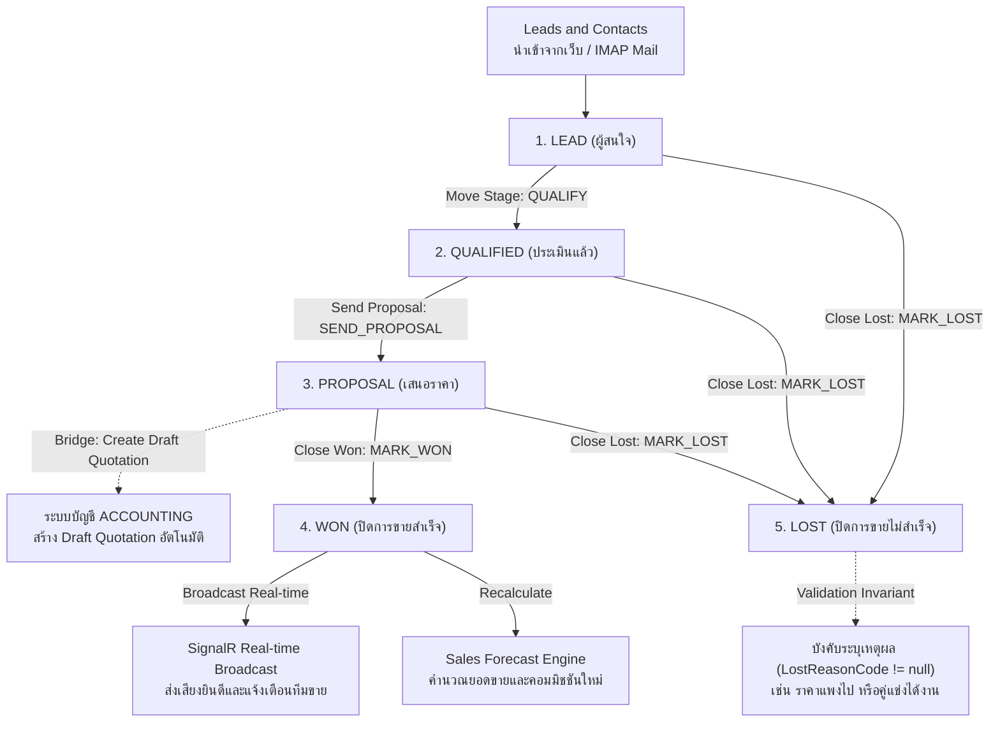
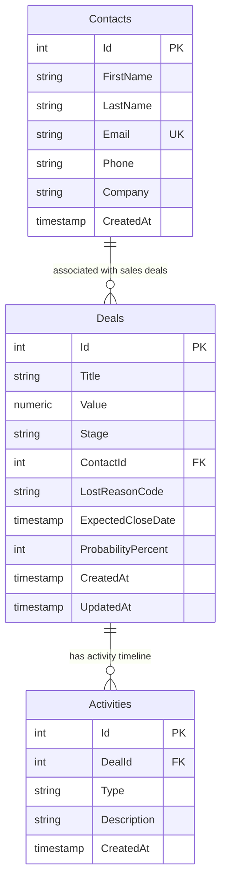

# 08_CRM_ENGINE: Enterprise Sales Pipeline & Deal Management

ระบบบริหารความสัมพันธ์ลูกค้าและกระบวนการขาย (Customer Relationship Management - CRM) พร้อมกระดาน Kanban Board แบบลากวาง (Drag & Drop), การเชื่อมต่ออีเมลสองทาง (IMAP/SMTP), การคำนวณคาดการณ์ยอดขาย (Sales Forecast) แบบ Real-time, และการเชื่อมต่อระบบบัญชีเพื่อออกใบเสนอราคาอัตโนมัติ

---

## 🔄 ภาพรวม Workflow การทำงาน (Business & Technical Workflow)



### รายละเอียดขั้นตอนการเปลี่ยนสถานะ (State Transitions):
1. **`LEAD ➔ QUALIFIED` (Trigger: `QUALIFY`)**: พนักงานขายโทรพูดคุยและประเมินงบประมาณ (Budget, Authority, Need, Timeline)
2. **`QUALIFIED ➔ PROPOSAL` (Trigger: `SEND_PROPOSAL`)**: ส่งใบเสนอราคาทางอีเมล พร้อมสั่งให้ระบบสร้าง Draft Quotation ในระบบบัญชี
3. **`PROPOSAL ➔ WON` (Trigger: `MARK_WON`)**: ลูกค้าเซ็นรับข้อเสนอ ปิดการขายสำเร็จ ส่งสัญญาณ Real-time ฉลองความสำเร็จทั้งออฟฟิศ
4. **`ANY ➔ LOST` (Trigger: `MARK_LOST`)**: กรณีลูกค้าปฏิเสธ ต้องระบุสาเหตุตาม **Invariant Rule** เพื่อนำข้อมูลไปวิเคราะห์ต่อ

---

## 🗄️ Database Design & Entity Relationships (PostgreSQL 18)

### 1. Entity-Relationship Diagram (ER Diagram)



### 2. รายละเอียดตารางและความสัมพันธ์ (Schema & Relationships)
- **`Contacts` (ข้อมูลลูกค้าและผู้ติดต่อ)**:
  - เก็บข้อมูลชื่อ-นามสกุล, อีเมล (Unique), เบอร์โทรศัพท์ และบริษัทคู่ค้า
  - ความสัมพันธ์: `1 Contact` สามารถเปิดได้หลาย `Deals`
- **`Deals` (ดีลการขายใน Pipeline)**:
  - Foreign Key: `ContactId` ➔ `Contacts(Id)`
  - เก็บมูลค่าดีล (`Value`), สเตจของ Kanban (`LEAD`, `QUALIFIED`, `PROPOSAL`, `WON`, `LOST`), โอกาสสำเร็จ (`ProbabilityPercent`), และเหตุผลเมื่อแพ้ดีล (`LostReasonCode`)
  - ตารางนี้บังคับ Invariant `StageTransitionsSequentialOrClosed` และ Invariant `LostRequiresReasonCode`
- **`Activities` (ประวัติกิจกรรมและการติดต่อ)**:
  - Foreign Key: `DealId` ➔ `Deals(Id)`
  - บันทึกการโทร, อีเมล, การนัดหมายประชุม และการเปลี่ยนสเตจแบบเรียงลำดับเวลา (Audit Trail)

---

## 🛡️ กฎเหล็กของระบบ (Domain Invariants)

1. **`StageTransitionsSequentialOrClosed` (การเปลี่ยน Stage ต้องเป็นไปตามลำดับขั้น หรือปิดดีล)**:
   - ป้องกันไม่ให้พนักงานขายข้ามขั้นตอนสำคัญ เช่น จาก Lead กระโดดไป Won ทันทีโดยไม่มีการส่ง Proposal ก่อน
2. **`LostRequiresReasonCode` (ต้องระบุเหตุผลเมื่อแพ้ดีล)**:
   - ห้ามมาร์กดีลเป็น `LOST` โดยไม่ระบุสาเหตุ เพื่อให้ผู้บริหารสามารถวิเคราะห์สาเหตุการแพ้ดีล (Loss Reason Analytics) และปรับปรุงกลยุทธ์ขององค์กรได้

---

## 💻 Tech Stack & เหตุผลในการเลือกใช้

| ส่วนประกอบ | เทคโนโลยีที่เลือก | เหตุผลที่เลือก | ข้อดีหลัก (Advantages) |
|---|---|---|---|
| **Database** | **PostgreSQL 18** | มาตรฐาน RDBMS พร้อม Indexing ความเร็วสูง | มี Auto-Init Script (`db/init.sql`) พร้อมข้อมูลลูกค้าและดีลตัวอย่าง |
| **Frontend Kanban** | **Next.js 16 + @dnd-kit/core** | ไลบรารี Drag & Drop ประสิทธิภาพสูง รองรับ Touch Screen และ Keyboard Accessibility | ลากวางการ์ดดีลข้ามสเตจได้อย่างลื่นไหล 60 FPS ไม่หน่วง |
| **Real-time Pipeline** | **@microsoft/signalr** | การอัปเดตกระดานแบบ Multi-user Real-time Synchronization | เมื่อเพื่อนร่วมทีมขยับดีล หน้าจอของทุกคนในทีมจะอัปเดตทันทีแบบไม่มีข้อขัดแย้ง |
| **Backend API** | **.NET 10 (C#) + MediatR** | CQRS Architecture ที่แข็งแกร่ง | แยกขั้นตอนการประมวลผลดีลและการส่งอีเมลออกจากกันอย่างมีระเบียบ |
| **Email Protocol** | **MailKit / MimeKit** | ไลบรารีจัดการอีเมล IMAP/SMTP มาตรฐานสูงสุดใน .NET | อ่านอีเมลตอบกลับจากลูกค้าและแนบประวัติการสนทนาเข้ากับดีลได้แบบอัตโนมัติ |

---

## 🚀 วิธีการรันระบบ (Quick Start)

### ตัวเลือกที่ 1: รันด้วย Docker Compose (แนะนำ)
```bash
docker compose up --build -d
```
> ระบบจะรัน **PostgreSQL 18** (`:5432`), **.NET 10 API** (`:5040`), และ **Next.js 16 Web** (`:3004`) พร้อม Seed กระดาน Kanban ทันที

### ตัวเลือกที่ 2: รันแบบแยก Service (Manual)
1. **รัน Backend API**:
   ```powershell
   cd crm-api
   dotnet run
   ```
   > API พร้อมทำงานที่: `http://localhost:5040`
2. **รัน Frontend Web**:
   ```powershell
   cd crm-web
   bun run dev
   ```
   > เข้าใช้งานได้ที่: `http://localhost:3004`
